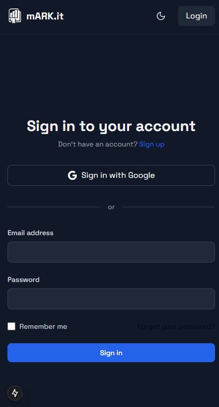
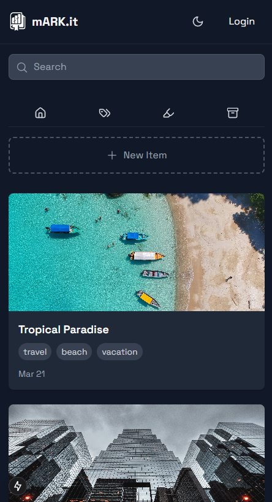

<div align="center">

  <h1>
    <br/>
    mARK.IT
  </h1>

> mARK.it is a hybrid bookmark management system that helps users capture, organize, and synchronize bookmarks from various platforms into a single, centralized interface.

  <p>
    <a href="https://github.com/Da-devs/mARK.it/blob/main/LICENSE">
      
    </a>
    
  </p>

  <p>
    <a href="#features">Features</a> •
    <a href="#tech-stack">Tech Stack</a> •
    <a href="#getting-started">Getting Started</a> •
    <a href="#docs">Docs</a> •
    <a href="#ecosystem">Ecosystem</a>
  </p>
</div>

---

##  Features

## 🚀 Browser Extension (Capture Bookmarks Easily)  
- One-click bookmarking for any website.  
- Automatically saves URL, title, and metadata.  
- Works on **Chrome, Firefox, and Edge**.  
- Sends bookmarks directly to the web app.  

## 🗂 Web App (Organize & Manage Bookmarks)  
- Clean UI for viewing and searching bookmarks.  
- Supports **tagging, categorization, and filtering**.  
- Import bookmarks from **Chrome, Firefox, and JSON/CSV files**.  

## 🔄 Sync & Export  
- **Auto-sync** between browser extension and web app.  
- Export bookmarks in **HTML, JSON, and CSV** formats.  
- **Offline support** – access saved bookmarks without internet. 

---

## Tech Stack


### 🌐 Browser Extension  
- **Tech:** Manifest V3, JavaScript  
- **Supported Browsers:** Chrome & Firefox  

### 🎨 Frontend (Web App)  
- **Framework:** [Next.js](https://nextjs.org)  
- **Styling:** [React](https://reactjs.org), [Tailwind CSS](https://tailwindcss.com)  

### 🖥 Backend & Storage  
- **API Framework:** [Supabase](https://supabase.com)(Open Shource Alternative for Firebase)  
- **Database:** [Supabase](https://supabase.com) (PostgreSQL, Auth, Realtime)

### 🛠 Tooling  
- **CLI Tools:** [Supabase CLI](https://supabase.com/docs/reference/cli/introduction)  


---

## Screenshots

| **Dashboard (Dark Mode)** <br/> | **Dashboard (Light Mode)** <br/> |
| ---------------------------------------------------------------------------------------------- | ---------------------------------------------------------------------------------------------------- |
| **Extension UI** <br/>                | **Search Bookmarks** <br/> |

---

|  |  |
|:---:|:---:|
| **Login Page** | **Mobile Responsive** |

## 🎯 Getting Started

### 📌 Prerequisites

- [Node.js](https://nodejs.org) (v14+)
- [npm](https://www.npmjs.com/)
- [Supabase](https://supabase.com) account
---

### ⚡ Installation & Setup

1. **Clone the repository**
   ```bash
   https://github.com/Da-devs/mARK.it.git
   cd mARK.it
   ```

2. **Install dependencies**
   ```bash
   npm install
   ```
3. **Create a Supabase account**
   - Go to [Supabase](https://supabase.com) and sign up for a free account.
   - Create a new project in the Supabase dashboard.
   - Note down the `API URL` and `anon key` from the project settings.

   
4. **Set up environment variables**
   - Create a `.env.local` file in the `mark.it` directory.
   - Add your Supabase credentials to the `.env.local` file:
     ```env
     NEXT_PUBLIC_SUPABASE_URL=your-supabase-url
     NEXT_PUBLIC_SUPABASE_ANON_KEY=your-supabase-anon-key
     NEXT_PUBLIC_EXTENSION_ID=your-extension-id
     ```

5. **Configure the application**
   - Update the `config.js` file with your Supabase details:
     ```javascript
     const CONFIG = {
         ROOT_URL: "http://localhost:3000",
         API_BASE_URL: "YOUR-SUPABASE_API_URL",
         ANON_KEY: "YOUR-NEXT_PUBLIC_SUPABASE_ANON_KEY"
     };
     ```

6. **Run the development server**
   ```bash
   npm run dev
   ```

7. **Open your browser**
   - Navigate to `http://localhost:3000` to see the web app.